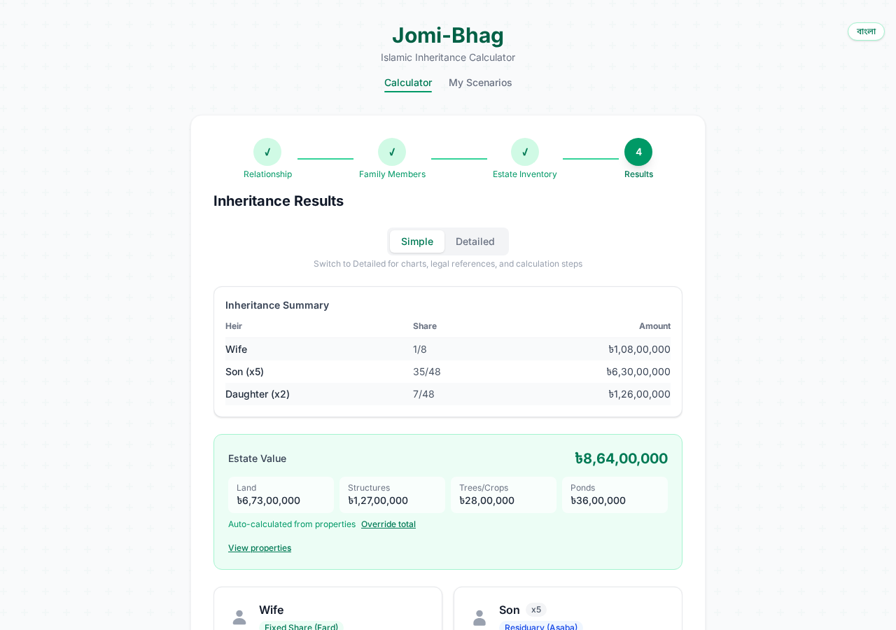
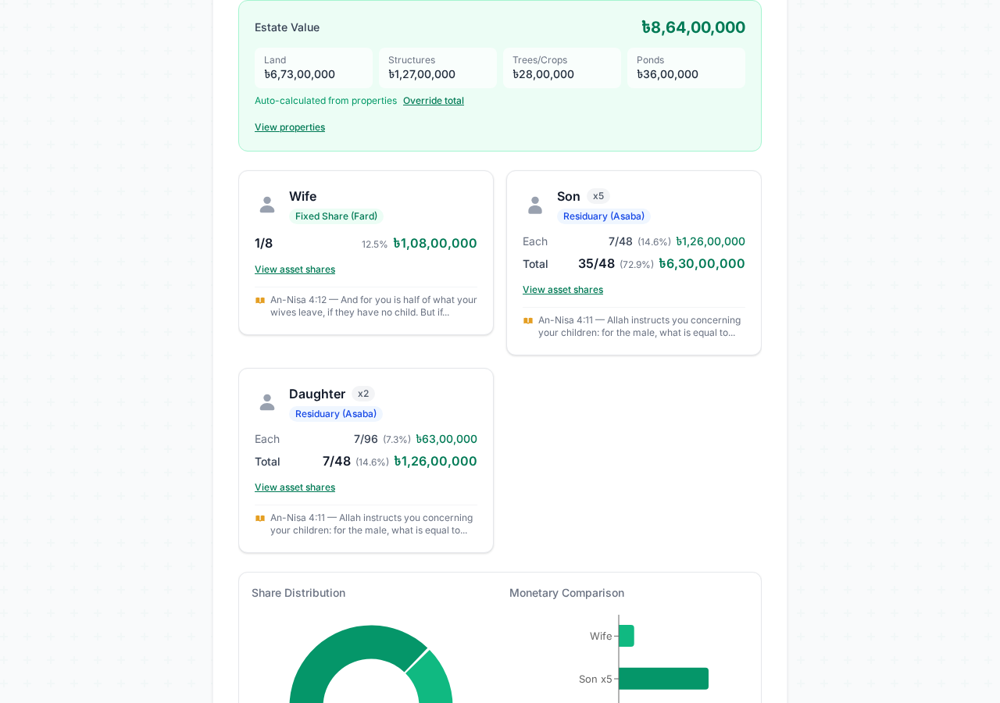
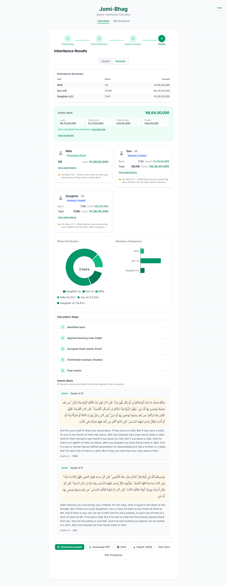
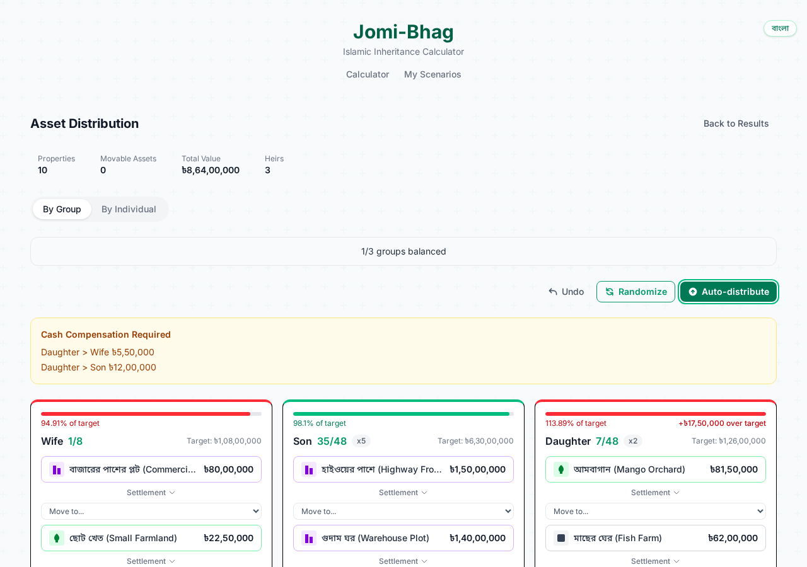

# Jomi-Bhag (জমি-ভাগ)

**Islamic inheritance (Faraid) land and property division calculator for Bangladeshi families.**

**Live:** [jomibhag.netlify.app](https://jomibhag.netlify.app)

Jomi-Bhag helps Bangladeshi families and legal professionals calculate and divide inherited property strictly according to Hanafi Faraid jurisprudence. Every share allocation uses exact fraction arithmetic (no floating-point rounding errors) and is traceable to its Quranic ayah or Hadith source. The app covers the full lifecycle from heir input to asset distribution to printable legal reports.

Fully bilingual -- Bangla (বাংলা) and English.

---

## Screenshots

<table>
  <tr>
    <td align="center"><b>Wizard - Bangla</b></td>
    <td align="center"><b>Results - English</b></td>
  </tr>
  <tr>
    <td></td>
    <td></td>
  </tr>
  <tr>
    <td align="center"><b>Heir Cards & Quranic References</b></td>
    <td align="center"><b>Charts & Calculation Steps</b></td>
  </tr>
  <tr>
    <td></td>
    <td></td>
  </tr>
  <tr>
    <td align="center"><b>Asset Distribution Board</b></td>
    <td align="center"><b>Full Results (Heir Cards + Actions)</b></td>
  </tr>
  <tr>
    <td></td>
    <td></td>
  </tr>
  <tr>
    <td align="center" colspan="2"><b>Mobile View (375px+)</b></td>
  </tr>
  <tr>
    <td align="center" colspan="2"></td>
  </tr>
</table>

---

## Features

### Bilingual Support (বাংলা / English)

- Full Bangla and English interface with one-click language toggle
- Default language: Bangla -- designed for Bangladeshi users
- All labels, headings, descriptions, and tooltips translated
- PDF reports render in the selected language
- Language preference persisted across sessions

### Faraid Calculation Engine

- Exact fraction arithmetic using fraction.js -- no floating-point rounding
- Full Hanafi jurisprudence support with 17 heir types
- All 16 Hajb Hirman (total blocking) and 5 Hajb Nuqsan (partial reduction) rules
- Awl (proportional reduction when shares exceed estate) and Radd (surplus redistribution)
- Special cases: Umariyyatayn, Mushtarakah, Kalalah
- MFLO Section 4 opt-in toggle for orphaned grandchildren

### Interactive Wizard

- 4-step guided flow: Relationship, Family Members, Estate Inventory, Results
- Family tree visualization for selecting relationships
- Supports spouse, children (sons/daughters/grandchildren), siblings (full/consanguine/uterine)
- JSON import/export for saving and loading scenarios
- Mobile-responsive design (375px+)

### Property and Land Input

- Multiple property types: agricultural, residential, commercial, mixed
- Bangladesh-specific land units (decimal, katha, bigha) with regional conversion (Dhaka vs Rajshahi katha)
- Sub-items: houses/structures (brick, tin, semi-pucca), trees/crops (itemized or lump sum), ponds
- Government mouza rate auto-suggestion for 84 upazilas across 8 divisions

### Movable Assets

- Gold and silver input with weight (vori/tola/gram), purity, and BAJUS rate suggestion
- Cash, vehicles, jewelry, furniture, livestock, investments, and custom items
- Indivisible asset resolution: sell, buyout, or Qurah (Islamic lot drawing)

### Asset Distribution Board

- Kanban board for distributing land parcels and movable assets among heir groups
- Real-time equilibrium indicators (green/amber/red) showing Faraid target alignment
- Smart auto-distribution and randomization algorithms
- Per-individual breakdown (Son 1, Son 2, Daughter 1, etc.) with inline rename
- Parcel splitting for precise area-based division
- Drag-and-drop with keyboard and touch support

### Land Settlement Methods

- Sell and Split proceeds among heirs
- Physical Division by value with sub-parcels and cash compensation
- Buyout with installment plan (no interest -- Islamic finance compliant)
- Joint Ownership with income calculator (rent/crop)

### Results and References

- Dual mode: Simple (fractions/percentages/BDT) and Detailed (full calculation trace with legal citations)
- Every share backed by Quranic ayah (Surah An-Nisa) and/or Hadith reference
- Step-by-step calculation explanation showing blocking, shares, and adjustments
- Pie chart (share distribution) and bar chart (monetary comparison)
- Scenario comparison (side-by-side "what if" analysis)

### Export and Persistence

- PDF download and print with full inheritance report, property breakdown, settlement plan, and individual allocation
- JSON export/import for backup and portability
- localStorage persistence (survives page refresh)

---

## Tech Stack

| Layer | Technology |
|-------|-----------|
| Frontend | React 19, TypeScript 5.9, TailwindCSS 4, Vite 8 |
| State | Zustand with localStorage persistence |
| Charts | Recharts |
| PDF | @react-pdf/renderer |
| Drag and Drop | @dnd-kit |
| Animations | Motion (Framer Motion) |
| Math | fraction.js (exact arithmetic) |
| i18n | React Context + hook (no external library) |
| Testing | Vitest + Testing Library + Playwright (E2E) |
| Hosting | Netlify (static site) |
| Runtime | Bun |

---

## Development

```bash
bun install
bun run dev          # Start dev server (http://localhost:5173)
bun run build        # Production build
bun run test:run     # Unit/integration tests (744 tests)
bun run test:e2e     # E2E tests (Playwright)
```

---

## Islamic Basis

All calculations follow Hanafi Faraid jurisprudence as derived from the Quran (primarily Surah An-Nisa 4:11-12, 4:176) and Sunnah. Every share allocation in the app is traceable to its specific scriptural source. The engine enforces Faraid rules without manual override or favoritism toward any heir.

This app is a calculation aid, not a legal substitute. Users are advised to consult qualified Islamic scholars and lawyers before executing any inheritance division or property registration.

---

## License

Free forever -- public service for the Bangladeshi community.
